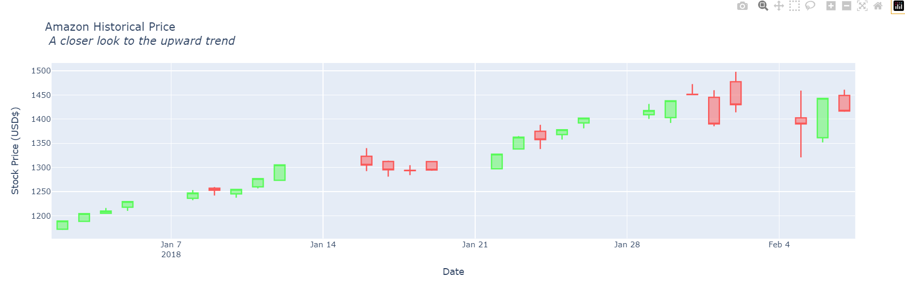
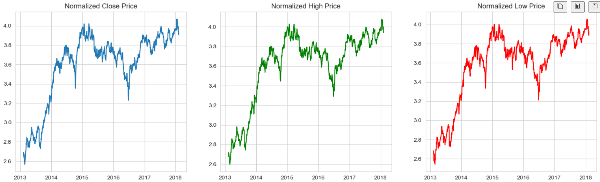

# 📈 Stock Time Series Forecasting using LSTM + ARIMA

This project demonstrates **hybrid time series forecasting** using both **statistical modeling (ARIMA)** and **deep learning (LSTM)**. It analyzes historical stock closing prices to forecast future trends and assess volatility and risk.

---

## 🔍 Objective

- Forecast stock prices using **ARIMA** and **LSTM** models  
- Decompose time series into **trend**, **seasonality**, and **residuals** using STL  
- Evaluate **volatility** and **risk** using:
  - STL decomposition  
  - Rolling standard deviation  
  - **Value at Risk (VaR)** at 95% confidence  
  - **Sharpe Ratio**

---

## 📊 Dataset

- Dataset: `all_stocks_5yr.csv`  
- Source: Kaggle (5 years of daily stock price data for AMZN, AAPL, GOOGL, MSFT)  
- Features: `date`, `close`, `high`, `low`, `open`, `volume`, `ticks`  

---

## 🧠 Models Used

| Technique | Purpose |
|-----------|---------|
| **ARIMA** | Traditional time series forecasting |
| **LSTM**  | Deep learning model for sequential data |
| **STL**   | Seasonal-Trend decomposition |
| **VaR**   | Quantifying risk at 95% confidence |
| **Sharpe Ratio** | Risk-adjusted return measure |

---
```
📦 Stock_analysis/
 ┣ 📂 Images/
 ┃ ┣ Amazon_Historical_price.png
 ┃ ┣ Normalized_prices.png
 ┃ ┣ STL Decomposition & Log (Closing Prices).png
 ┃ ┗ Volatility and Bolinger bands.png
 ┣ 📄 all_stocks_5yr.csv
 ┣ 📄 requirements.txt
 ┗ 📄 Stock_analysis.ipynb
```


## 📈 Visuals

### ✅ Amazon Stock Price


### ✅ Normalized Closing Prices


### ✅ STL Decomposition (Trend + Seasonality + Residuals)


### ✅ Bollinger Bands for Volatility


---

Key Findings
ARIMA model works well on short-term stationarized data

LSTM model captures long-term trends with better flexibility

STL decomposition revealed seasonality and trend shifts

Volatility captured with rolling standard deviation and Bollinger Bands

Value at Risk (VaR 95%) = -0.7670 → Max expected loss in a day

Sharpe Ratio = 0.30 → Moderate risk-adjusted return

---


## 📦 Requirements

Install all required Python packages:

```bash
pip install -r requirements.txt
```
